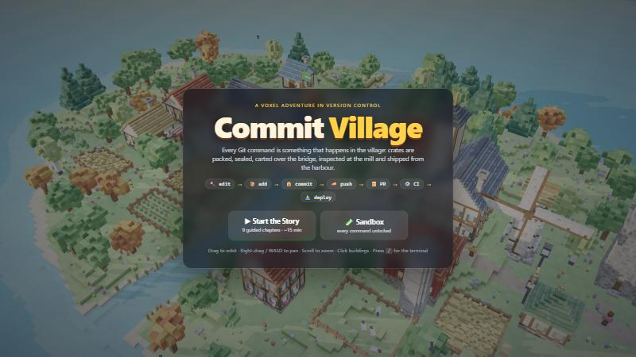
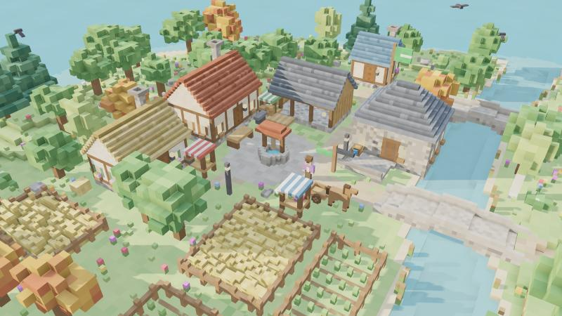
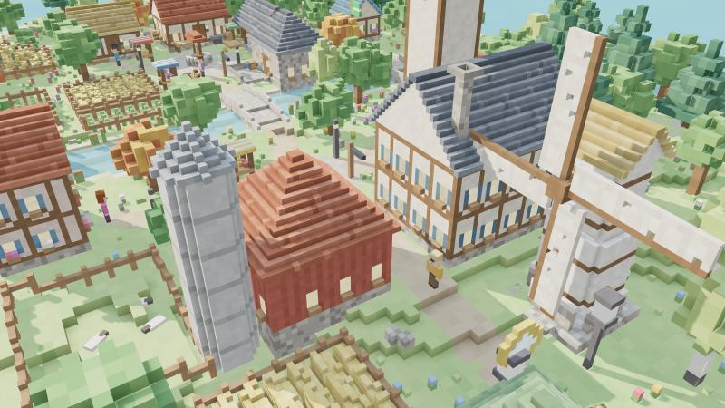
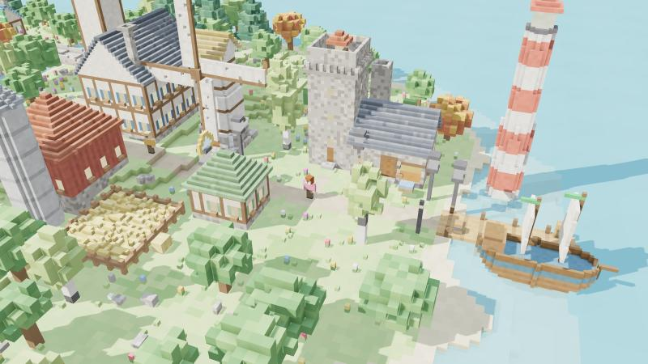
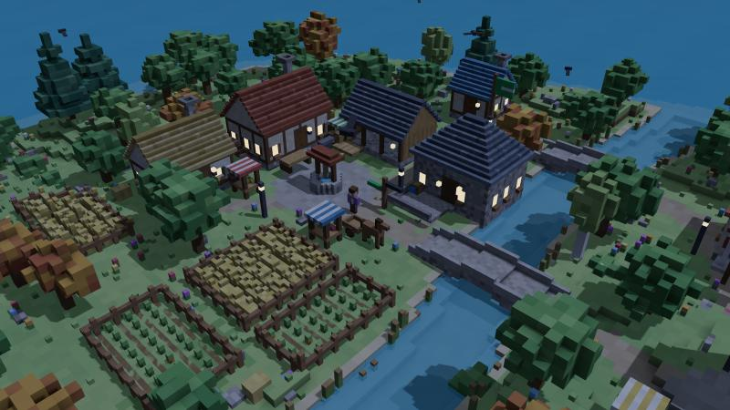
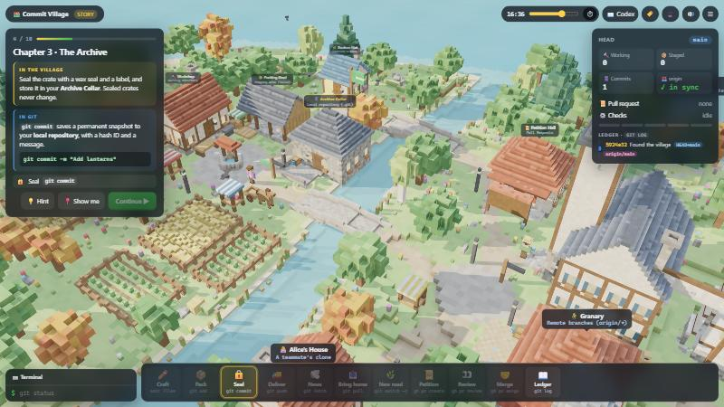

# Commit Village 🏘️

> **Created using GitHub Copilot**

**▶ Play it live: [github-village.web.app](https://github-village.web.app)**

A voxel village where Git & GitHub come to life. Instead of reading about `git push`, you **watch a horse cart carry your sealed crates over the bridge to the Town Hall**.



---

## 🎮 The idea

Git is invisible: commands go in, text comes out. Commit Village makes every step **a place you can see and a thing that physically happens**:

| In the village | In Git / GitHub |
|---|---|
| 🔨 **Workshop**: parchments on the workbench | Working directory: modified files |
| 📦 **Packing Shed**: goods packed into a crate | `git add`: staging area |
| 🔒 **Archive Cellar**: crate sealed with a wax-seal hash | `git commit`: local repository |
| 🌊 **River & stone bridge** | The network |
| 🚚 **Horse cart → Town Hall Granary** | `git push` to GitHub (`origin`) |
| ✋ **Cart turned back at the gate** | Rejected push: pull first |
| 🕊️ **Messenger pigeon** | `git fetch` |
| 📥 **Cart brings crates home** | `git pull` (fetch + merge) |
| 👩 **Alice's house** | A teammate pushing to the same repo |
| 🌿 **Side road to the Feature Hut** | Branch (`git switch -c`) |
| 📜 **Petition Hall** | Pull Request + code review |
| ⚙️ **Mill → 🔍 Inspector → 🧪 Watchtower → 🔥 Forge** | CI pipeline (GitHub Actions) |
| 🔔 **Red lamp & bell** | A failing check |
| ⛵ **Ship sails from the harbour** | Deploy to production |

## 📸 Screenshots

| Your village (local machine) | Town Hall & Granary (GitHub) |
|---|---|
|  |  |
| **Pipeline valley & harbour (CI/CD)** | **Night falls (day/night cycle)** |
|  |  |

**Story mode HUD**: mission card, live `git status` panel, commit ledger, terminal and action dock:



## 🧭 How to play

**Story mode** (~15 min, 9 chapters):
1. **Tour**: fly over the four districts (Local · River · Town · Pipeline)
2. **Craft**: edit files in the Workshop
3. **Stage**: `git add .` at the Packing Shed
4. **Commit**: seal the crate in the Archive
5. **Push**: cart it across the bridge
6. **Teammates**: Alice pushes → you `git fetch` → `git pull`
7. **Branch**: `git switch -c feature/lanterns`, then craft, pack and seal on the side road
8. **Pull Request & CI**: open a petition, the mill runs checks… and **a test fails** 🔔. Fix it and push again
9. **Review, merge & ship**: Alice approves, you merge, the ship deploys 🎆

**Sandbox mode**: every command unlocked. Make Alice push and then try pushing yourself to see a rejected push.

**Three ways to act:** click the action dock, click a building, or **type real commands** in the terminal (`git commit -m "msg"`, `git switch -c x`, `gh pr create`, …).

| Control | Action |
|---|---|
| Drag | Orbit |
| Right-drag / WASD | Pan |
| Scroll | Zoom |
| Click building | Inspect & act |
| `/` | Focus terminal |

## 🛠️ Run locally
No build step. Three.js is vendored in `lib/`.
```bash
python -m http.server 5173
```
Open http://localhost:5173. Handy demo URLs:
- `?speed=3`: fast-forward animations
- `?mode=story&step=7`: jump to a chapter
- `?time=21`: set the time of day
- `?clean&cam=x,z,dist,yaw,pitch`: UI-free camera shots

## 🧱 Under the hood
| File | What |
|---|---|
| `js/voxel.js` | Voxel mesher (hidden-face culling + per-vertex ambient occlusion), noise, tweens, particles, sound |
| `js/world.js` | Island terrain, river, roads, timber-framed buildings, trees, villagers, sheep, ship |
| `js/git.js` | Mini Git model (commit graph, local/remote refs, fast-forward checks, PR, CI) + the animated scene for each command |
| `js/ui.js` | Story chapters, terminal parser, HUD, labels |
| `js/main.js` | Renderer, day/night sky, camera, main loop |
| `docs/DESIGN.md` | Analogy map, UX flow, world layout |

Deployed with Firebase Hosting.
